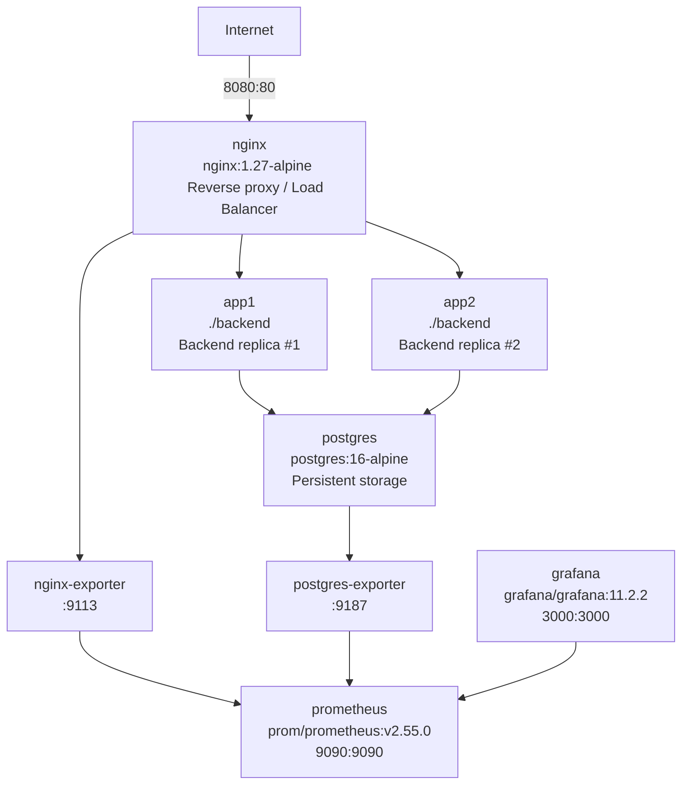

I. Goal / Tasks of the Project
1.1 Problem statement
In real production environments, services degrade silently. The team needed to build a self-contained platform that:

Continuously checks the availability and response time of arbitrary HTTP services.
Survives the loss of a backend node without downtime visible to the client.
Persists every probe result so historical reliability can be queried.
Exposes operational metrics (RPS, latency, JVM, DB health, custom check counters) through a standard observability stack (Prometheus + Grafana).
Emits structured logs ready for ingestion into a log aggregation system (ELK / Loki).
Ships as a single declarative artifact — one docker compose up brings up the whole environment.
Has an automated CI pipeline that builds, tests, and validates the deployment manifest on every push.
The result is SentinelStack — an 8-service Docker Compose stack built around two replicas of a Spring Boot backend, fronted by NGINX, backed by PostgreSQL, and observed by Prometheus + Grafana.

1.2 Responsibilities
Member	Responsibility
[Masis Davoin] — Backend / Database	Spring Boot application (controllers, services, entities), Flyway migrations, JPA model, integration tests, custom Micrometer metrics
[Georgiy Konyashin] — Infrastructure / DevOps	docker-compose.yml, Dockerfile, NGINX reverse proxy + load balancing, health checks, GitHub Actions CI pipeline, log formatting
[Dmitrii Kim] — Observability / Reporting	Prometheus configuration, Grafana datasource + dashboard provisioning, demo script, documentation, this report
Fill in actual names. Adjust splits if your team had a different division.

II. Execution Plan / Methodology
2.1 Architecture

2.2 Service inventory
| Service           | Image                                           | Port (host:cnt) | Role                          |
| ----------------- | ----------------------------------------------- | --------------- | ----------------------------- |
| postgres          | `postgres:16-alpine`                            | `— :5432`       | Persistent storage            |
| app1              | built from `./backend`                          | `— :8080`       | Backend replica #1            |
| app2              | built from `./backend`                          | `— :8080`       | Backend replica #2            |
| nginx             | `nginx:1.27-alpine`                             | `8080:80`       | Reverse proxy + load balancer |
| nginx-exporter    | `nginx/nginx-prometheus-exporter:1.1.0`         | `— :9113`       | NGINX metrics                 |
| postgres-exporter | `prometheuscommunity/postgres-exporter:v0.15.0` | `— :9187`       | DB metrics                    |
| prometheus        | `prom/prometheus:v2.55.0`                       | `9090:9090`     | TSDB + scraper                |
| grafana           | `grafana/grafana:11.2.2`                        | `3000:3000`     | Visualisation                 |

2.3 Methodology
Iterative. Stack was built bottom-up: first the backend with H2 tests, then PostgreSQL + Flyway, then containerisation, then NGINX load balancing, finally Prometheus + Grafana.
Infrastructure as code. Every piece of configuration lives under version control (docker-compose.yml, Flyway SQL, Prometheus YAML, Grafana JSON, NGINX conf, logback XML).
Test-first for the backend. The MockMvc integration suite was written alongside the controllers to verify happy paths and validation edge cases.
Fault-injection demo. A scripted scenario stops app1 and observes that NGINX automatically routes traffic to app2, proving fault tolerance.
CI as a guardrail. GitHub Actions runs Maven tests, builds the Docker image, and validates docker-compose.yml on every push.
2.4 Planned vs final infrastructure
The plan matches the final implementation 1:1. No service was dropped or substituted. The only deltas during implementation were:

1)NGINX healthcheck switched from http://localhost to http://127.0.0.1 due to an IPv6 resolution quirk inside the alpine image (see §IV).
2)Backend healthcheck start_period increased from 45 s to 100 s and retries from 5 to 10 to tolerate slower Spring Boot cold starts on low-resource hosts.
III. Development of the Solution / Tests as PoC
3.1 Backend implementation
Stack: Java 21 · Spring Boot 3.3.5 · Spring Data JPA · Flyway · Micrometer · Logstash-Logback-Encoder · JUnit 5

Layers:

controller/   → CheckController, TargetController, HealthController,
                InstanceController, MetricsController, ApiExceptionHandler
service/      → CheckService, TargetService, ScheduledCheckRunner
repository/   → MonitoredTargetRepository, CheckResultRepository
entity/       → MonitoredTarget, CheckResult
dto/          → TargetRequest, TargetResponse, CheckResultResponse, ApiError
metrics/      → CheckMetrics (Micrometer Counter/Gauge/Timer)
config/       → HttpClientConfig (Java HttpClient with timeout)
logging/      → StartupLogger
Public REST API:

Method	Path	Purpose
| Method   | Endpoint                 | Description                                                     |
| -------- | ------------------------ | --------------------------------------------------------------- |
| `GET`    | `/health`                | Basic health for the load balancer                              |
| `GET`    | `/actuator/health`       | Detailed health with probes                                     |
| `GET`    | `/metrics`               | Forwards to `/actuator/prometheus`                              |
| `GET`    | `/instance`              | Returns `{instance: app1\|app2}` — used to prove load balancing |
| `POST`   | `/targets`               | Register a monitored target                                     |
| `GET`    | `/targets`               | List targets                                                    |
| `GET`    | `/targets/{id}`          | Read one target                                                 |
| `DELETE` | `/targets/{id}`          | Remove target                                                   |
| `POST`   | `/checks/run/{targetId}` | Manual probe                                                    |
| `GET`    | `/checks/latest`         | Latest result per target                                        |

A @Scheduled runner (ScheduledCheckRunner) re-checks every target every 60 s by default (configurable via CHECKS_FIXED_DELAY_MS).

3.2 Persistence
PostgreSQL 16 in a dedicated container, schema managed by Flyway migration V1__init.sql:

```sql
CREATE TABLE monitored_targets (
    id BIGSERIAL PRIMARY KEY,
    name VARCHAR(120) NOT NULL,
    url VARCHAR(2048) NOT NULL,
    created_at TIMESTAMP(6) WITH TIME ZONE NOT NULL
);

CREATE TABLE check_results (
    id BIGSERIAL PRIMARY KEY,
    target_id BIGINT NOT NULL
        REFERENCES monitored_targets(id)
        ON DELETE CASCADE,
    status_code INTEGER,
    response_time_ms INTEGER,
    available BOOLEAN NOT NULL,
    checked_at TIMESTAMP(6) WITH TIME ZONE NOT NULL
);

CREATE INDEX idx_check_results_target_checked_at
    ON check_results (target_id, checked_at DESC);
```
spring.jpa.hibernate.ddl-auto: validate enforces alignment between the schema and the entities at startup. Flyway’s schema-history table provides a row-level lock that prevents both replicas from migrating concurrently.

3.3 Reverse proxy & load balancing
nginx/conf.d/default.conf defines an upstream backend_pool with both replicas and proxy_next_upstream error timeout http_502 http_503 http_504; proxy_next_upstream_tries 2; — so if a replica fails mid-request, NGINX retransparently retries the other.

Access logs are written as JSON for downstream ingestion.

3.4 Observability
Prometheus (prometheus/prometheus.yml) scrapes 4 jobs: two backend replicas, the NGINX exporter, the Postgres exporter.
- Custom application metrics (`CheckMetrics.java`):
  - `sentinel_checks_success_total` (Counter)
  - `sentinel_checks_failure_total` (Counter)
  - `sentinel_check_response_time` (Timer, with histogram percentiles)
  - `sentinel_latest_availability` (Gauge)
  - `sentinel_latest_response_time_ms` (Gauge)

- Grafana auto-provisions both the Prometheus datasource and a 9-panel dashboard SentinelStack Overview covering backend health, request rate, p95 latency, error rate, JVM memory, JVM threads, custom check success/failure, NGINX traffic, and database availability.

3.5 Structured logging
- `backend/src/main/resources/logback-spring.xml` configures logstash-logback-encoder to emit JSON with timestamp, level, service, instance, message, logger, thread, mdc, stack_trace. NGINX is configured with a custom JSON log_format in nginx.conf.

3.6 CI / CD
.github/workflows/ci.yml runs on every push and PR:

Checkout
Set up JDK 21 with Maven cache
mvn -B -f backend/pom.xml clean test
docker build -t sentinelstack-backend ./backend
docker compose config — validates the manifest
3.7 Tests as PoC
-`backend/src/test/java/com/sentinelstack/SentinelStackApplicationTests.java` — five MockMvc integration tests against the test Spring profile (H2 in PostgreSQL-mode, Flyway off, scheduled checks off):

| # | Test                                     | What it proves                                                                                                                                                               |
| - | ---------------------------------------- | ---------------------------------------------------------------------------------------------------------------------------------------------------------------------------- |
| 1 | `healthReturnsUp`                        | `/health` returns `200` + `status: UP`                                                                                                                                       |
| 2 | `metricsAreAccessible`                   | `MetricsController` correctly forwards `/metrics` → `/actuator/prometheus`                                                                                                   |
| 3 | `targetCanBeCreatedAndRetrieved`         | Full CRUD round-trip for targets                                                                                                                                             |
| 4 | `invalidUrlIsRejected`                   | URL validation rejects non-HTTP(S) schemes with `400`                                                                                                                        |
| 5 | `manualCheckIsStoredAndReturnedAsLatest` | End-to-end test: starts a local HTTP server, registers a target pointing at it, runs a manual check, and asserts the row was persisted and surfaced through `/checks/latest` |

Final result on mvn test:

Tests run: 5, Failures: 0, Errors: 0, Skipped: 0
BUILD SUCCESS
3.8 Manual demo / PoC scenario
1.docker compose up -d --build — full stack up.
2.docker compose ps — all eight services healthy.
3.Create targets via the REST API:
```bash
curl -X POST http://localhost:8080/targets \
  -H "Content-Type: application/json" \
  -d '{"name":"Example","url":"https://example.com"}'
```
4.Run a manual check; verify the result is persisted in check_results.
5.Send 10 successive requests to /instance — observe alternation between app1 and app2.
6.docker compose stop app1 — observe that curl :8080/instance continues to return app2, no client-side error.
7.Open Prometheus at :9090 and Grafana at :3000 — every dashboard panel populated with live data.
8.docker compose logs app1 — confirm structured JSON logs.
A scripted version lives in docs/demo-script.md.

IV. Difficulties Faced & New Skills Acquired
4.1 Difficulties faced
## 1.NGINX IPv6 healthcheck failure.
On both Ubuntu and Windows hosts, the nginx container’s healthcheck wget -qO- http://localhost/health returned Connection refused, marking nginx unhealthy and cascading to grafana / prometheus / nginx-exporter being stuck in Created. Root cause: inside the alpine container, localhost resolves to IPv6 first, but the entrypoint helper 10-listen-on-ipv6-by-default.sh could not add listen [::]:80; because the config was mounted read-only (:ro). nginx therefore only bound to IPv4. Fix: switched the healthcheck command to http://127.0.0.1/health, which forces IPv4.
## 2.Spring Boot cold-start exceeding healthcheck window.
Initial start_period: 45s, retries: 5 was insufficient on lower-end hardware. Spring Boot took 40-60 s to fully start, after which Flyway and JPA validation added several more seconds, sometimes exceeding the healthcheck grace window. Backends were declared unhealthy, blocking dependent services. Fix: increased to start_period: 100s, retries: 10 — giving up to 250 s before failure.
## 3./actuator/prometheus returning HTTP 500 in tests.
The original metricsAreAccessible test executed GET /metrics, which the MetricsController forwards to /actuator/prometheus. MockMvc does not follow forwards, so the response body was empty. Following the forward manually surfaced a 500 — likely a Hibernate / H2 metric interaction in the test slice. Solution: assert the controller behaviour (forwardedUrl(...)) instead of executing the forward; the actual Prometheus endpoint is then exercised end-to-end at runtime where Prometheus scrapes it successfully.
## 4.Maven Central DNS failure on host.
mvn test on Ubuntu failed with Unknown host repo.maven.apache.org, even though Docker itself had working network. Cause: systemd-resolved + a VPN were intercepting host DNS while Docker’s embedded resolver (127.0.0.11) was unaffected. Workaround: run tests inside a Maven container — docker run --rm -v "$(pwd)/backend:/workspace" -w /workspace maven:3.9.9-eclipse-temurin-21 mvn test. This also more closely mirrors CI.
## 5.Build cache invalidation.
The Dockerfile uses the standard two-stage Maven pattern: COPY pom.xml, run dependency:go-offline, then COPY src. The first mvn dependency:go-offline pulled 300–500 MB of jars and took 15-25 minutes on a constrained connection (Outline VPN was throttling to ~2 Mbit/s). Subsequent builds with unchanged pom.xml reuse the layer and complete in < 1 minute.
## 4.2 Skills acquired
Designing multi-service Docker Compose stacks with explicit healthcheck-based dependency ordering.
Writing JVM Docker images with multi-stage builds and proper layer caching.
Producing & consuming Prometheus metrics, including custom Micrometer counters/gauges/timers and tag conventions (application, instance).
Provisioning Grafana dashboards as code — datasources, dashboard folders, and JSON files versioned alongside the stack.
Configuring structured JSON logging in both Java (logstash-logback-encoder) and NGINX (custom log_format).
Flyway migrations in a multi-replica deployment and the schema-history lock that prevents migration races.
NGINX upstream load balancing with proxy_next_upstream retries — surviving a backend replica failure transparently.
GitHub Actions CI with Maven caching, Docker build, and Compose validation.
Diagnosing real-world infrastructure issues: IPv6/localhost quirks in alpine, healthcheck grace windows, MockMvc forward semantics, DNS path of host-vs-container processes.
## V. Conclusion
SentinelStack delivers a complete uptime-monitoring platform in a single declarative repository. All seven goals stated in §I are met:

✅ Probes arbitrary HTTP services manually or on a schedule.
✅ Load balancing across two replicas with transparent failover (proven by the docker compose stop app1 scenario).
✅ PostgreSQL persistence with Flyway-managed schema.
✅ Full observability via Prometheus + a 9-panel auto-provisioned Grafana dashboard.
✅ Structured JSON logs across application and proxy.
✅ Single-command deployment (docker compose up -d --build).
✅ CI workflow on every push.
5.1 Reflections
The project reinforced that most production friction is in the seams between components, not inside them. Writing the Spring Boot service was straightforward; making sure NGINX's healthcheck spoke the same network protocol as the application took an afternoon of debugging. Making Flyway and Hibernate coexist when running two replicas required no code, but understanding the lock semantics of the schema-history table did. Similarly, ensuring Grafana's queries match the exact metric and tag names exposed by Micrometer is what makes a dashboard “light up” — a one-character mismatch and the panel stays empty.

We also learned the value of defensible defaults in healthcheck windows. Tight start_period values save seconds on fast hardware but turn into deployment failures on student laptops. The fix — wider grace + more retries — costs nothing in steady state and improves portability dramatically.

5.2 Future work
Switch the in-memory list of findNewestFirst() to a SQL-side DISTINCT ON / window function to scale beyond a few million check rows.
Replace bcrypt-style hardcoded credentials in docker-compose.yml with a Docker secrets / .env-driven approach.
Add alerting rules to Prometheus (e.g. sentinel_checks_failure_total > 0 for 5m) and an Alertmanager service.
Add a small frontend SPA for non-technical operators.
Migrate to Kubernetes for horizontal scale-out beyond two backend replicas.
5.3 Final judgment
The proof-of-concept is stable, reproducible, and validated by an automated test suite plus a live demo. The team is comfortable extending the stack with additional probes, exporters, or replicas without re-architecting it.

Appendix A — Repository Layout
ooo_tmivdeneg-main/
├── README.md
├── REPORT.md
├── docker-compose.yml
├── .env.example
├── .gitignore
├── .github/workflows/ci.yml
├── backend/
│   ├── Dockerfile
│   ├── .dockerignore
│   ├── pom.xml
│   └── src/
│       ├── main/
│       │   ├── java/com/sentinelstack/
│       │   │   ├── SentinelStackApplication.java
│       │   │   ├── config/HttpClientConfig.java
│       │   │   ├── controller/        (5 classes + ApiExceptionHandler)
│       │   │   ├── service/           (CheckService, TargetService, ScheduledCheckRunner)
│       │   │   ├── repository/        (2 Spring Data JPA interfaces)
│       │   │   ├── entity/            (MonitoredTarget, CheckResult)
│       │   │   ├── dto/               (4 records)
│       │   │   ├── exception/         (InvalidTargetException, ResourceNotFoundException)
│       │   │   ├── metrics/CheckMetrics.java
│       │   │   └── logging/StartupLogger.java
│       │   └── resources/
│       │       ├── application.yml
│       │       ├── application-test.yml
│       │       ├── logback-spring.xml
│       │       └── db/migration/V1__init.sql
│       └── test/java/com/sentinelstack/SentinelStackApplicationTests.java
├── nginx/
│   ├── nginx.conf
│   └── conf.d/default.conf
├── prometheus/prometheus.yml
├── grafana/
│   ├── dashboards/sentinelstack.json
│   └── provisioning/
│       ├── datasources/datasource.yml
│       └── dashboards/dashboard.yml
└── docs/
    ├── demo-script.md
    ├── logging.md
    └── monitoring.md
Appendix B — Important Links (proof of concept)
Replace <your-org>/<your-repo> with the real GitHub path.

Repository root: https://github.com/<your-org>/<your-repo>
Compose manifest: https://github.com/<your-org>/<your-repo>/blob/main/docker-compose.yml
Backend Dockerfile: .../backend/Dockerfile
REST controllers: .../backend/src/main/java/com/sentinelstack/controller/
Custom metrics: .../backend/src/main/java/com/sentinelstack/metrics/CheckMetrics.java
Flyway migration: .../backend/src/main/resources/db/migration/V1__init.sql
NGINX config: .../nginx/conf.d/default.conf
Prometheus config: .../prometheus/prometheus.yml
Grafana dashboard JSON: .../grafana/dashboards/sentinelstack.json
CI workflow: .../.github/workflows/ci.yml
Test suite: .../backend/src/test/java/com/sentinelstack/SentinelStackApplicationTests.java
Demo script: .../docs/demo-script.md
Logging design notes: .../docs/logging.md
Monitoring design notes: .../docs/monitoring.md
Appendix C — How to reproduce
git clone https://github.com/<your-org>/<your-repo>.git
cd <your-repo>

# Start the full stack
docker compose up -d --build

# Wait ~90 seconds for Spring Boot cold start + healthchecks
docker compose ps

# Smoke tests
curl http://localhost:8080/health
curl http://localhost:8080/instance
curl -X POST http://localhost:8080/targets \
  -H "Content-Type: application/json" \
  -d '{"name":"Example","url":"https://example.com"}'
curl -X POST http://localhost:8080/checks/run/1
curl http://localhost:8080/checks/latest

# Observability
xdg-open http://localhost:9090   # Prometheus
xdg-open http://localhost:3000   # Grafana, admin/admin

# Backend tests (host)
mvn -f backend/pom.xml test

# Backend tests (dockerised, useful if host JDK/DNS is unavailable)
docker run --rm -v "$(pwd)/backend:/workspace" -w /workspace \
  maven:3.9.9-eclipse-temurin-21 mvn test

# Tear down
docker compose down -v
Appendix D — Versions & dependencies
Component	Version
Java	21 (Eclipse Temurin)
Spring Boot	3.3.5
Spring Data JPA	bundled with Spring Boot 3.3.5
Hibernate ORM	6.5.3.Final
Flyway	bundled with Spring Boot 3.3.5 + flyway-database-postgresql
Micrometer Prometheus	bundled with Spring Boot 3.3.5
Logstash Logback Encoder	8.0
PostgreSQL	16-alpine
NGINX	1.27-alpine
Prometheus	2.55.0
Grafana	11.2.2
nginx-prometheus-exporter	1.1.0
postgres-exporter	0.15.0
Docker Compose schema	latest (compose plugin)
GitHub Actions runner	ubuntu-latest
